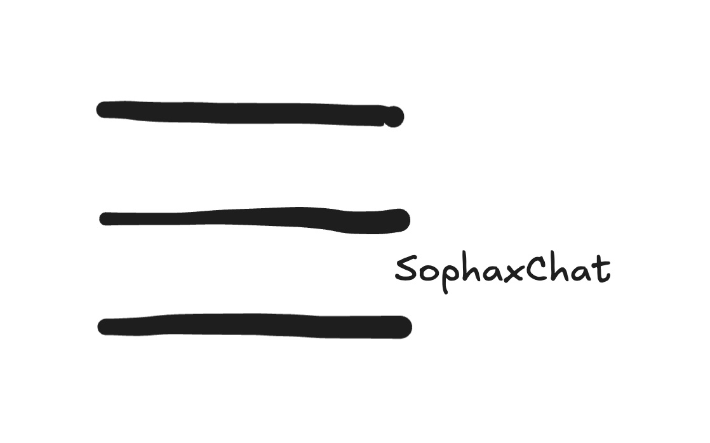
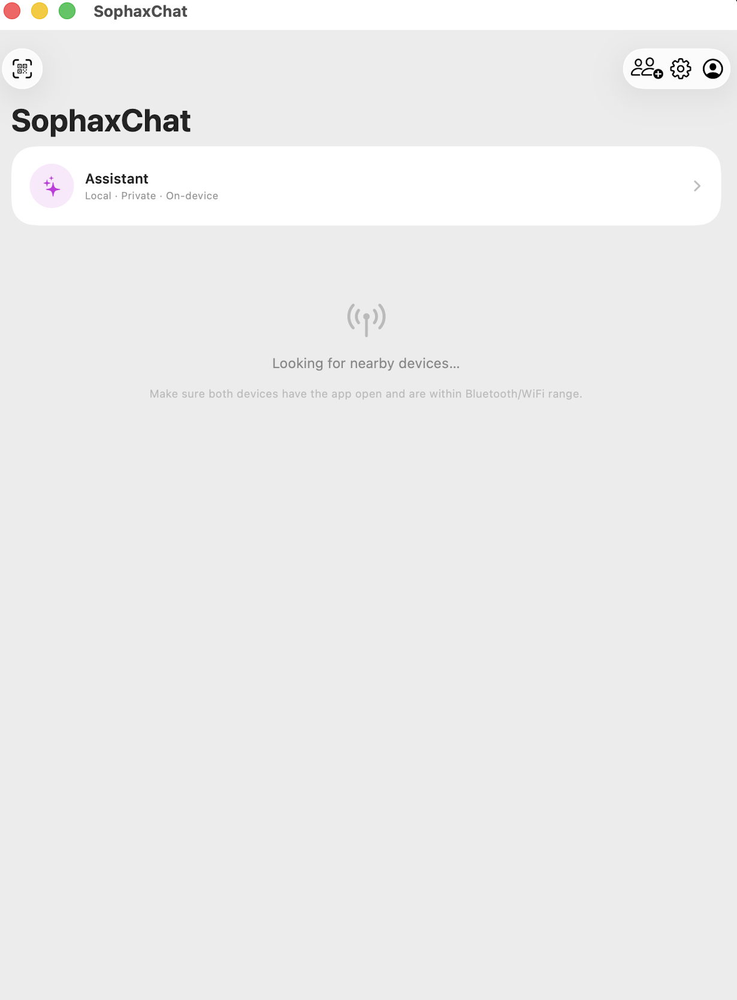
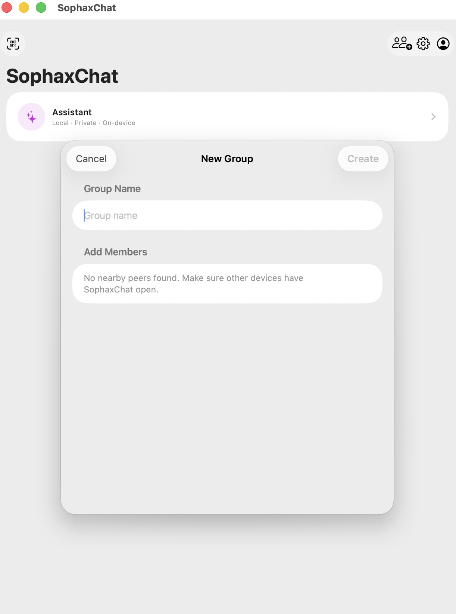
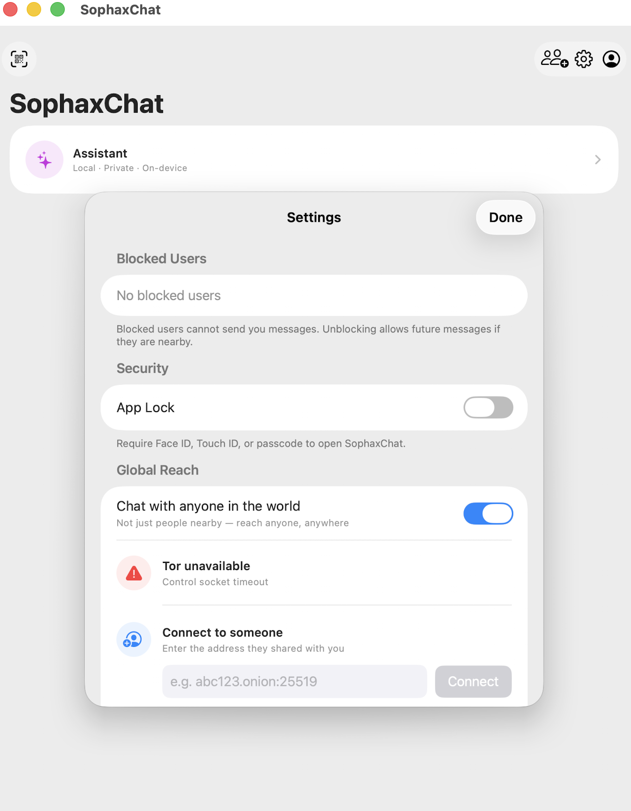
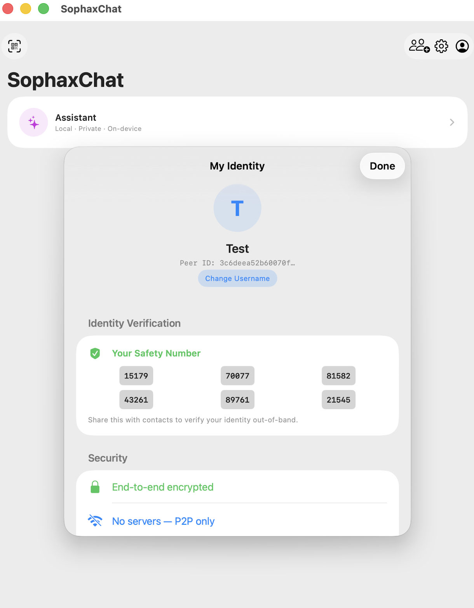

<div align="center">
  

  <h1>SophaxChat</h1>

  <p><strong>Works offline over Bluetooth mesh. Reaches anyone in the world over Tor. No servers. No phone number. No account.</strong></p>

  <p>
    
    
    
    
    
    
    
    <a href="https://github.com/sophaxtechnologies/SophaxChat/actions/workflows/swift.yml">
      
    </a>
    <a href="https://github.com/sophaxtechnologies/SophaxChat/actions/workflows/android-ci.yml">
      
    </a>
  </p>

  <p>
    <a href="#protocol">Protocol</a> •
    <a href="#cryptography">Cryptography</a> •
    <a href="#features">Features</a> •
    <a href="#architecture">Architecture</a> •
    <a href="#getting-started">Getting Started</a> •
    <a href="#android">Android</a> •
    <a href="#security">Security</a> •
    <a href="#roadmap">Roadmap</a>
  </p>

  <br />

  > ⚠️ **Alpha — not yet production-ready.** Cryptographic primitives are sound, but the codebase has not been independently audited. Do not rely on it for life-critical anonymity.

  <br />

  **[TestFlight beta — coming soon](https://github.com/sophaxtechnologies/SophaxChat/issues)** &nbsp;·&nbsp; **[Mac: works today with a free Apple ID](#run-on-mac-catalyst)** &nbsp;·&nbsp; **[Android](android/README.md)**

</div>

---

<div align="center">

| | |
|:---:|:---:|
|  |  |
|  |  |

<sub>Running on macOS via Xcode — "My Mac (Designed for iPad)"</sub>

</div>

---

## What is SophaxChat?

SophaxChat is an **open-source, serverless, end-to-end encrypted** messenger for iOS, macOS, and Android.

**Nearby** — it works over Bluetooth LE and WiFi Direct. No internet, no servers, no pairing. Messages relay across multiple devices automatically (up to 6 hops), so you reach people even when you're not directly connected.

**Globally** — enable TCP and connect through **[Orbot](https://apps.apple.com/app/orbot/id1609461599)** (Tor). Your traffic is anonymous, your IP is hidden, and you can reach anyone in the world with a `.onion` address. No configuration inside SophaxChat — Orbot handles everything.

In both modes: **no phone number, no email, no account**. Your identity is a Curve25519 key pair, generated on your device, never transmitted to any server. Every message uses the **Signal Protocol** (X3DH + Double Ratchet with Header Encryption).

> **Is it still "Anonymous, offline, end-to-end encrypted mesh chat"?**
> Yes — and more. Local mode (BLE/WiFi) is fully offline and anonymous as always. With TCP enabled via Orbot/Tor, it becomes *global*: still anonymous (no account, no phone number), still end-to-end encrypted (same X3DH + Double Ratchet pipeline), still decentralized (no servers — direct peer-to-peer). TCP and Tor support are optional and off by default.

### Who is SophaxChat for?

**Journalists and activists** — communicate without leaving traces tied to a phone number or account. Combine with Tor (Orbot VPN mode) for transport anonymity.

**Disaster responders and field workers** — no internet? Bluetooth and WiFi mesh still work. Devices relay messages across the network automatically, up to 6 hops.

**Privacy-conscious users** — tired of surrendering your phone number to chat apps. Here, your identity is a cryptographic key pair, generated locally, never shared with any server.

**Developers and researchers** — the full source is open. Cryptographic primitives (X3DH, Double Ratchet, Header Encryption, Sealed Sender) are implemented in ~3 500 lines of auditable Swift using Apple's CryptoKit.

### Philosophy

SophaxChat is built around three principles that cannot be traded away:

1. **No servers, ever.** Servers are honeypots. Every central point is a single point of failure, surveillance, and censorship. SophaxChat communicates directly device-to-device — over Bluetooth, WiFi, and peer-to-peer TCP. The Tor network (via Orbot) provides internet routing without introducing any trusted server.

2. **No identity leakage.** No phone number, no email, no account. Your identity is a Curve25519 key pair, generated on your device, never transmitted to any server. The app doesn't even know your name unless you choose to set one.

3. **Maximum cryptographic protection, not just "good enough".** X3DH gives each session unique key material. Double Ratchet rotates keys every message. Header Encryption hides routing metadata from relay nodes. Sealed Sender hides who is talking to whom. These are not features — they are the baseline.

### Why does it exist?

| Scenario | Signal | Telegram | WhatsApp | bitchat | SophaxChat |
|---|:---:|:---:|:---:|:---:|:---:|
| No internet connection (BLE/WiFi mesh) | ❌ | ❌ | ❌ | ✅ | ✅ |
| LAN auto-discovery (same WiFi, no pairing) | ❌ | ❌ | ❌ | ❌ | ✅ |
| Internet reach (TCP, peer-to-peer) | ✅ | ✅ | ✅ | ❌ | ✅ |
| Tor / anonymity network support | ⚠️ | ❌ | ❌ | ❌ | ✅ |
| No phone number required | ❌ | ⚠️¹ | ❌ | ✅ | ✅ |
| Signal-grade forward secrecy | ✅ | ⚠️² | ✅ | ❌ | ✅ |
| Per-session unique keys (X3DH) | ✅ | ⚠️² | ✅ | ❌ | ✅ |
| Header encryption (relay metadata) | ✅ | ❌ | ❌ | ❌ | ✅ |
| Sealed sender (hides sender from relay) | ✅ | ❌ | ❌ | ❌ | ✅ |
| No server dependency | ❌ | ❌ | ❌ | ✅ | ✅ |
| No metadata collection | ❌ | ❌ | ❌³ | ✅ | ✅ |
| End-to-end encrypted groups | ✅ | ⚠️² | ✅ | ❌ | ✅ |
| Open-source | ⚠️ | ⚠️⁴ | ❌ | ✅ | ✅ |
| Multihop relay (mesh routing) | ❌ | ❌ | ❌ | ✅ | ✅ |
| iOS + Android cross-platform | ✅ | ✅ | ✅ | ❌ | ✅ |
| macOS support | ✅ | ✅ | ✅ | ❌ | ✅ |

<sub>¹ Telegram requires a phone number to register; usernames added in 2023 do not replace this requirement. ² Telegram's MTProto E2EE applies only to "Secret Chats" — regular chats, groups, and channels are server-side encrypted (Telegram holds the keys). ³ WhatsApp uses Signal Protocol for message content but collects extensive metadata: who you talk to, when, how often, your IP address, device fingerprint, and contact graph — all shared with Meta. ⁴ Telegram clients are open-source; the server is closed-source and proprietary.</sub>

**Compared to privacy-focused alternatives:**

| Feature | Briar | Session | SimpleX | SophaxChat |
|---|:---:|:---:|:---:|:---:|
| Bluetooth / WiFi mesh (no internet) | ✅ | ❌ | ❌ | ✅ |
| iOS support | ❌ | ✅ | ✅ | ✅ |
| No server dependency | ✅ | ❌¹ | ❌² | ✅ |
| No phone number / email required | ✅ | ✅ | ✅ | ✅ |
| X3DH + Double Ratchet (Signal spec) | ❌³ | ❌⁴ | ✅ | ✅ |
| Header Encryption (hides routing metadata) | ❌ | ❌ | ❌ | ✅ |
| Sealed Sender (hides sender from relay) | ❌ | ❌ | ❌ | ✅ |
| MLS (RFC 9420) group encryption | ❌ | ❌ | ❌ | ✅ |
| Tor integration | ✅ | ❌ | ❌ | ✅ |
| macOS support | ❌ | ✅ | ✅ | ✅ |
| Full open-source (client + protocol) | ✅ | ✅ | ✅ | ✅ |

<sub>¹ Session routes messages through the decentralized Oxen network — not truly serverless, nodes hold messages until delivery. ² SimpleX uses relay servers for delivery; users can self-host but cannot eliminate the relay dependency. ³ Briar uses the custom Bramble protocol; per-message forward secrecy is achieved differently, without the X3DH session-setup guarantees. ⁴ Session removed X3DH to enable async account creation; sessions lack the session-setup forward-secrecy properties of Signal's full handshake.</sub>

SophaxChat occupies a specific niche: **Signal-grade cryptography, zero infrastructure**. Ideal for journalists, activists, protesters, disaster responders, or anyone in an environment where internet access is unavailable, monitored, or untrusted.

> **No server means no one to betray you.**

---

## Protocol

### 1:1 Session Lifecycle

```
┌─ Alice ─────────────────────────────────────────────────────────── Bob ─┐

  [1. DISCOVERY — MultipeerConnectivity (Bluetooth LE / WiFi Direct)]

      Alice ←──── MPC peer found ────→ Bob

  [2. HELLO — Immediate key exchange on connection]

      Alice ──── Hello(PreKeyBundle_A) ────→ Bob
      Alice ←─── Hello(PreKeyBundle_B) ──── Bob

  [3. SESSION INIT — X3DH key agreement, first encrypted message]

      Alice computes:
        DH1 = DH(IK_A, SPK_B)
        DH2 = DH(EK_A, IK_B)
        DH3 = DH(EK_A, SPK_B)
        DH4 = DH(EK_A, OPK_B)  [if available]
        SK  = HKDF(DH1 || DH2 || DH3 || DH4)

      Alice ──── InitiateSession(EK_A, usedKeyIDs, DR_msg_0) ────→ Bob
                                                         Bob derives SK from his keys
                                                         Bob inits Double Ratchet

  [4. MESSAGES — Double Ratchet + Header Encryption]

      Alice ──── SealedSender(encHeader, encBody) ────→ Bob
      Alice ←─── SealedSender(encHeader, encBody) ──── Bob

  [5. RELAY — If Alice and Bob not directly connected]

      Alice ──── Relay(TTL=6, target=Bob, msg) ────→ Charlie ────→ Bob
                                                     (TTL=5)

└─────────────────────────────────────────────────────────────────────────┘
```

### Group Session Lifecycle

```
┌─ Alice (creator) ─────────────────────── Bob, Carol ─┐

  [1. CREATE — Alice generates group and her sender chain]

      Alice: senderChainKey_A = random(32 bytes)

  [2. INVITE — Sent via per-peer Double Ratchet channel]

      Alice ──── GroupInvite(groupID, senderChainKey_A) ────→ Bob
      Alice ──── GroupInvite(groupID, senderChainKey_A) ────→ Carol

  [3. JOIN — Each member generates their own sender chain]

      Bob:   senderChainKey_B = random(32 bytes)
      Carol: senderChainKey_C = random(32 bytes)

      Bob   ──── SenderKeyDistribution(senderChainKey_B) ────→ Alice, Carol
      Carol ──── SenderKeyDistribution(senderChainKey_C) ────→ Alice, Bob

  [4. GROUP MESSAGE — Each sender uses their own KDF chain]

      messageKey_n   = HMAC-SHA256(chainKey_n, 0x01)
      chainKey_{n+1} = HMAC-SHA256(chainKey_n, 0x02)

      Alice ──── GroupMsg(ciphertext, iteration=n) ────→ Bob, Carol
                                    (broadcast via mesh)

└──────────────────────────────────────────────────────┘
```

### Key Properties

- **Forward secrecy** — each message uses a unique message key. Compromising key `n` reveals nothing about keys `< n`.
- **Break-in recovery** — after a compromise, DH ratchet steps generate fresh key material from new Curve25519 ephemeral keys. Each group member ratchets independently.
- **Header encryption** — ratchet headers (public key, counters) are sealed with rotating header keys. Relay nodes see only opaque ciphertext.
- **Sealed sender** — sender identity is hidden from relay nodes; only the intended recipient can learn who sent the message.
- **Multihop relay** — messages flood through the mesh with TTL=6, deduplicated via LRU cache.
- **Offline queue** — messages queued in memory when no peers are reachable; drained automatically on reconnect.
- **Disappearing messages** — optional `expiresAt` timestamp; messages purged locally every 60 seconds. Supported in both 1:1 and group conversations.

---

## Cryptography

All primitives come from Apple's **[CryptoKit](https://developer.apple.com/documentation/cryptokit)** — hardware-accelerated and independently audited by Apple.

| Layer | Operation | Algorithm | Key Size |
|---|---|---|---|
| Identity | Signing | Ed25519 | 256-bit |
| Identity | Key agreement | X25519 | 256-bit |
| Session init | Key exchange | X3DH | — |
| Session init | Key derivation | HKDF-SHA256 | 256-bit |
| Messaging | Symmetric ratchet | HMAC-SHA256 | 256-bit |
| Messaging | DH ratchet | X25519 | 256-bit |
| Messaging | AEAD encryption | ChaCha20-Poly1305 | 256-bit |
| Header encryption | AEAD | ChaCha20-Poly1305 | 256-bit |
| Sealed sender | Key derivation | HKDF-SHA256 | 256-bit |
| Sealed sender | AEAD | ChaCha20-Poly1305 | 256-bit |
| Group Sender Keys | KDF chain | HMAC-SHA256 | 256-bit |
| Group encryption | AEAD | ChaCha20-Poly1305 | 256-bit |
| Storage | At-rest encryption | AES-256-GCM | 256-bit |
| Identity verification | Safety numbers | SHA-512 | — |

### Key Storage

All private keys and session states are stored in the **iOS Keychain** with `kSecAttrAccessibleWhenUnlockedThisDeviceOnly`:

- Not backed up to iCloud
- Not transferred to a new device
- Not accessible when the device is locked
- Wiped on device factory reset

---

## Features

### Messaging

| Feature | 1:1 | Group |
|---|:---:|:---:|
| Text messages | ✅ | ✅ |
| Image sharing | ✅ | ✅ |
| Voice messages (PTT, AAC M4A) | ✅ | ✅ |
| Reply to message (quoted bubble) | ✅ | ✅ |
| Message reactions (6-emoji) | ✅ | ✅ |
| Read receipts (blue tick) | ✅ | ✅ |
| Disappearing messages (30s–7d) | ✅ | ✅ |
| Forward message | ✅ | ✅ |
| Message search | ✅ | ✅ |
| Draft persistence (restored on re-open) | ✅ | ✅ |

### Groups

| Feature | Status |
|---|---|
| Create group (multi-peer picker) | ✅ |
| Signal-style Sender Keys (per-member KDF chain) | ✅ |
| Group invite via Double Ratchet channel | ✅ |
| Sender Key Distribution to all members | ✅ |
| Per-message forward secrecy (per-member) | ✅ |
| Leave group | ✅ |
| Member list sheet | ✅ |
| Group push notifications | ✅ |
| Out-of-order message recovery (skipped key cache, 200 keys/sender) | ✅ |
| Re-keying on member leave (forward secrecy) | ✅ |

### Security & Privacy

| Feature | Status |
|---|---|
| X3DH session establishment | ✅ |
| Double Ratchet + Header Encryption | ✅ |
| Sealed sender | ✅ |
| Ed25519 message signatures | ✅ |
| Safety Number verification (QR + manual) | ✅ |
| App lock (Face ID / Touch ID / passcode) | ✅ |
| Auto-lock on background | ✅ |
| App Switcher blur | ✅ |
| AES-256-GCM at-rest message storage | ✅ |
| Block peer | ✅ |
| TOFU key-change warning (Safety Number changed banner) | ✅ |
| Notification content hiding on lock screen | ✅ |
| Clipboard auto-clear (60s after copy) | ✅ |
| Keyboard privacy (autocorrect disabled, no learning) | ✅ |
| Screen recording warning banner | ✅ |
| Screenshot notification toast | ✅ |
| Screenshot prevention (screen appears blank) | ✅ |
| Duress PIN — decoy empty state on coercion | ✅ |
| Custom numeric lock PIN (alternative to biometrics) | ✅ |
| Full encrypted export — identity + messages (`.sxfe`) | ✅ |
| File sharing (arbitrary files ≤ 2 MB) | ✅ |

### Global Reach (Tor)

| Feature | Status |
|---|---|
| `.onion` address derived from identity key (no configuration) | ✅ |
| Orbot SOCKS5 support (route through Tor via proxy config) | ✅ |
| Contact Card — QR code + `sophaxchat://` deep link | ✅ |
| QR scanner for adding contacts | ✅ |
| `sophaxchat://add` deep link handling | ✅ |
| Tor onboarding (first-run guide) | ✅ |

### Local AI Assistant

| Feature | Status |
|---|---|
| On-device AI (Apple Foundation Models, iOS 26+) | ✅ |
| No server, no API key, no data leaves device | ✅ |
| Conversation memory within session | ✅ |
| Graceful fallback on unsupported devices | ✅ |

### Network & Transport

| Feature | Status |
|---|---|
| Bluetooth LE transport (iOS) | ✅ |
| WiFi Direct transport (iOS / Android) | ✅ |
| LAN auto-discovery via mDNS/Bonjour (same WiFi) | ✅ |
| iOS ↔ Android cross-platform messaging (TCP wire protocol) | ✅ |
| TCP internet transport (peer-to-peer, no server) | ✅ |
| Tor / SOCKS5 anonymity (Orbot VPN mode or proxy) | ✅ |
| GMS-free Android (Wi-Fi Direct fallback, no Google Play Services) | ✅ |
| Multihop relay (TTL=6) | ✅ |
| LRU relay deduplication | ✅ |
| Offline message queue | ✅ |
| Rate limiting (20 relays / 10s per peer + 50 / 10s global cap) | ✅ |
| Relay hop indicator in UI | ✅ |
| Typing indicators | ✅ |
| Store-and-forward via relay peers (48h TTL, 300 items) | ✅ |
| macOS Catalyst support | ✅ |

---

## Architecture

```
SophaxChat/
├── Sources/SophaxChatCore/          # Core library — pure Swift, testable
│   ├── Crypto/
│   │   ├── CryptoTypes.swift        # Types, constants, error definitions
│   │   ├── KeychainManager.swift    # Keychain CRUD for all key material
│   │   ├── IdentityManager.swift    # Ed25519 + X25519 identity lifecycle
│   │   ├── PreKeyManager.swift      # X3DH prekey pool (SPK + 20 OTPKs)
│   │   ├── X3DH.swift              # X3DH sender and receiver implementation
│   │   ├── DoubleRatchet.swift     # Double Ratchet + Header Encryption (Signal spec §4.3)
│   │   ├── Keccak.swift            # Minimal SHA3-256 (Tor v3 .onion checksum)
│   │   └── OnionAddress.swift      # Tor v3 .onion derivation from Ed25519 key
│   ├── Group/
│   │   ├── GroupTypes.swift         # GroupInfo, SenderKeyState, GroupCryptoVersion
│   │   ├── MLSGroupManager.swift    # MLS actor — wraps mls-rs via UniFFI
│   │   ├── ChatManager+MLS.swift    # MLS inbound/outbound handlers + dispatch router
│   │   └── GroupCryptoMigration.swift # Opt-in SKv2 → MLS migration scaffold
│   ├── MLS/
│   │   └── Generated/
│   │       └── sophax_mls.swift     # Auto-generated UniFFI Swift bindings (mls-rs)
│   ├── Network/
│   │   ├── NetworkProtocol.swift   # Wire message types + WireMessageBuilder
│   │   ├── MeshManager.swift       # MultipeerConnectivity P2P transport (BLE/WiFi)
│   │   ├── TCPTransport.swift      # Internet TCP transport (SOCKS5/Tor, port 25519)
│   │   └── RelayRouter.swift       # Multihop relay with LRU dedup cache
│   ├── Storage/
│   │   ├── MessageStore.swift      # AES-256-GCM encrypted at-rest storage
│   │   └── AttachmentStore.swift   # Encrypted blob store for images/audio
│   └── ChatManager.swift           # High-level coordinator (session + routing)
│
├── rust/                            # mls-rs Rust crate (compiled to XCFramework via UniFFI)
│   ├── src/lib.rs                  # Stateless MLS API: create/add/remove/encrypt/decrypt
│   └── Cargo.toml                  # mls-rs 0.54, RustCrypto backend (no OpenSSL)
│
├── scripts/
│   └── build_mls_xcframework.sh    # Cross-compile Rust → XCFramework for iOS/macOS
│
├── SophaxChat/                      # iOS/macOS SwiftUI application
│   ├── App/
│   │   ├── SophaxChatApp.swift     # App entry point, security overlays, deep links
│   │   └── AppState.swift          # @MainActor observable state, SOCKS5/Tor config
│   └── Views/
│       ├── Onboarding/             # First-run username setup
│       ├── AI/                     # Local AI assistant (Apple Foundation Models)
│       ├── Chat/                   # Chat list, 1:1 and group bubbles, relay indicator
│       └── Settings/               # Safety number, app lock, Contact Card, Tor setup
│
└── Tests/SophaxChatCoreTests/
    ├── CryptoTests.swift            # X3DH symmetry + Double Ratchet correctness
    └── MLSGroupManagerTests.swift   # MLS two-party, three-party, removal, epoch tests
```

> **macOS:** The app runs on macOS 14+ via Catalyst. `AVAudioSession` calls are guarded with `#if !targetEnvironment(macCatalyst)`. Peer discovery works over WiFi on macOS.

### Message Encryption Layers

Every message passes through four independent encryption layers before leaving the device:

```mermaid
sequenceDiagram
    autonumber
    participant A as Alice 📱
    participant R as Relay node 📡
    participant B as Bob 📱

    Note over A,B: Session setup — once per contact
    A->>B: Hello (PreKeyBundle: IK, SPK, OTPKs, avatar)
    B->>B: X3DH: DH₁⊕DH₂⊕DH₃⊕DH₄ → RootKey → Double Ratchet init

    Note over A,B: Every message — 4 layers applied on Alice's device
    rect rgb(20, 30, 48)
        Note over A: ① Double Ratchet — new symmetric key every message (forward secrecy)
        Note over A: ② Header Encryption — sequence numbers and ratchet keys sealed
        Note over A: ③ Sealed Sender — Alice's identity hidden from all relay nodes
        Note over A: ④ RelayEnvelope — TTL=6, LRU dedup, multihop routing
    end

    A->>R: Encrypted blob — relay sees ciphertext + TTL only
    Note over R: Cannot read: sender identity, recipient identity, or content
    R->>B: TTL decremented, rebroadcast unchanged
    B->>B: Unseal Sealed Sender → DR+HE decrypt → plaintext ✓
```



### Data Flow

```
SwiftUI View
    │  sendMessage() / sendGroupMessage()
    ▼
AppState (@MainActor)
    │
    ▼
ChatManager                  ← single coordinator, NSLock session mutex
    │
    ├─ 1:1 path
    │   ├─ buildOutboundWire()   ← X3DH init (new session) or DR+HE encrypt
    │   ├─ sealedSenderWrap()    ← ECDH(ephemeral, recipientDH) → ChaChaPoly
    │   └─ sendOrQueue()
    │           ├─ tcp.send()            if peer connected via TCP/internet
    │           ├─ mesh.send()           if peer directly connected (BLE/WiFi)
    │           ├─ mesh.broadcast()      relay via RelayEnvelope (TTL=6)
    │           └─ pendingQueue[]        offline; drained on reconnect
    │
    ├─ group path
    │   ├─ senderKeyRatchetStep()  ← HMAC-SHA256(chainKey, 0x01/0x02)
    │   ├─ ChaChaPoly encrypt      ← with per-message key
    │   └─ mesh.broadcast()        ← GroupWireMessage to all members
    │
    └─ didReceiveMessage()
            ├─ .hello                  → store PreKeyBundle, drain queue
            ├─ .initiateSession        → X3DH receiver, DR init, decrypt
            ├─ .message                → DR+HE decrypt, send ACK
            ├─ .ack / .readReceipt     → update message status
            ├─ .relay                  → process inner or forward (TTL-1)
            ├─ .groupInvite            → store group, generate sender chain, distribute SKD
            ├─ .groupMessage           → v2: ratchet peer chain; v1: shared key fallback
            └─ .senderKeyDistribution  → store peer sender chain state
```

---

## Android

The Android port uses the same wire protocol as iOS. Messages between iOS and Android are fully interoperable — same X3DH + Double Ratchet encryption, same JSON framing over TCP port 25519.

**Auto-discovery on the same WiFi:** iOS (Bonjour) and Android (NsdManager) both advertise `_sophaxchat._tcp`. They find each other automatically — no manual pairing, no IP addresses.

**GMS-free:** Works on GrapheneOS, CalyxOS, and any AOSP device. Google Play Services are detected at runtime; if absent, Wi-Fi Direct (`android.net.wifi.p2p.*`) is used instead. No GMS imports in the codebase.

**Feature parity with iOS:** The Android UI matches the iOS app on all key features — App Lock (BiometricPrompt), unread badges, typing indicators, message long-press menu (copy / delete / block / reply), reply-to-message with quoted preview, Safety Number screen, deep link confirmation dialog, onboarding slides, message reactions (6-emoji picker + reaction pills), disappearing messages (per-conversation timer, auto-cleanup), contact renaming, and per-conversation message search.

See [`android/README.md`](android/README.md) for build instructions and architecture.

---

## Getting Started

### Requirements

| Requirement | Version |
|---|---|
| Xcode | 16.0+ |
| iOS deployment target | 17.0+ |
| macOS deployment target | 14.0+ (Catalyst) |
| Physical devices | 2× iPhone (MultipeerConnectivity requires real hardware) |
| XcodeGen | latest (`brew install xcodegen`) |

> **Note:** The Swift core library (`SophaxChatCore`) builds without Xcode via `swift build`. Physical devices are required to test P2P connectivity; the simulator does not support MultipeerConnectivity peer discovery.

### Run on iPhone

```sh
# 1. Clone
git clone https://github.com/sophaxtechnologies/SophaxChat.git
cd SophaxChat

# 2. Generate Xcode project
brew install xcodegen
xcodegen generate

# 3. Open in Xcode
open SophaxChat.xcodeproj
```

In Xcode:
1. Select your **Team** under Signing & Capabilities
2. Plug in your iPhone, select it as the destination
3. **⌘R**

Repeat on a second device to test messaging.

### Run on Mac (Catalyst)

The app runs natively on macOS via Mac Catalyst — no iOS simulator needed.

```sh
xcodegen generate
open SophaxChat.xcodeproj
```

In Xcode:
1. Select target **SophaxChat** → tab **General** → under **Deployment Info** enable the **Mac** checkbox → choose **Mac Catalyst**
2. Set destination to **My Mac (Mac Catalyst)** in the toolbar
3. Signing & Capabilities → select your Team (free Apple ID works)
4. **⌘R**

> **Free Apple ID:** Mac Catalyst apps run on your own Mac without any developer account. No 7-day re-signing limit (unlike iOS sideloading).

**What works on Mac:**
- Full encrypted messaging (1:1 and group)
- Global reach via TCP + Tor (Orbot for Mac)
- Local AI assistant (macOS 26 + Apple Intelligence)
- QR Contact Cards (share / receive)
- All security features (App Lock uses Touch ID on Mac)

**What differs on Mac:**
- Peer discovery uses WiFi (no Bluetooth mesh on macOS Catalyst)
- Screen recording warning is disabled (screen recording is normal OS behavior on Mac)
- Camera picker uses the Mac camera

### Run on iPhone without an Apple Developer account (AltStore)

You can sideload SophaxChat on iPhone for free using [AltStore](https://altstore.io) — no Apple Developer account required.

1. Install **AltStore** on your Mac and iPhone ([altstore.io](https://altstore.io))
2. Clone + generate the Xcode project (steps above)
3. In Xcode: `Product → Archive` (select **Any iOS Device** as destination)
4. In the Organizer: **Distribute App → Save for Ad Hoc Deployment** → save the `.ipa`
5. In AltStore on your Mac: drag-and-drop the `.ipa` onto your iPhone
6. AltStore re-signs automatically every 7 days when AltServer is running on your Mac

> **Free Apple ID limit:** you can have 3 sideloaded apps active at a time. AltStore itself counts as one.

### Verify the core library (no Xcode needed)

```sh
swift build
```

### Tests

```sh
# Run in Xcode: Product → Test (⌘U)
```

Tests cover: X3DH key symmetry (with/without OTPK), Double Ratchet bidirectional messaging, out-of-order message delivery, session state persistence, associated data binding, and KDF distinctness.

---

## Security

See [SECURITY.md](SECURITY.md) for the full threat model, cryptographic primitive table, protocol details, and security review findings.

### What SophaxChat protects against

| Threat | Protection |
|---|---|
| Network eavesdropping | ChaCha20-Poly1305 E2EE; MPC transport encrypted (`.required`); TCP is a carrier of already-sealed WireMessages |
| MITM / impersonation | Ed25519 signatures on every message; Safety Number verification |
| Replay attacks | Unique nonce per message; message-ID deduplication at storage layer |
| Past message compromise | Forward secrecy via symmetric ratchet (per-message keys) |
| Future message compromise | Break-in recovery via DH ratchet (fresh Curve25519 ephemeral keys) |
| Header metadata leakage | Header Encryption — relay nodes see only opaque ciphertext |
| Sender identity leakage | Sealed sender — sender hidden from relay nodes via ECDH wrapping |
| Data at rest | AES-256-GCM encrypted message and attachment store |
| iCloud backup exfiltration | `kSecAttrAccessibleWhenUnlockedThisDeviceOnly`; keys never backed up |
| App Switcher screenshot | Content blurred on `willResignActive` |
| Unauthorized app access | App lock: Face ID / Touch ID / passcode, auto-lock on background |
| DoS via oversized messages | Attachment ≤ 512 KB; username ≤ 64 chars |
| Prekey exhaustion | OTPK pool auto-replenished when below 50%; SPK rotated every 7 days |

### Identity verification

Each user has a **Safety Number** — a 60-digit fingerprint derived from SHA-512 of their identity keys. Both numbers are shown side by side in the verification screen: each party reads their own number aloud to the other. Scan via QR code or compare manually.

### Known limitations

See [SECURITY.md § Security Review Findings](SECURITY.md) for full details. Key items:

| Finding | Severity | Summary |
|---|---|---|
| ~~H-1~~ | ~~HIGH~~ | ~~No group re-keying on member leave~~ — **fixed**: fresh sender chain rotated on every membership change |
| ~~M-1~~ | ~~MEDIUM~~ | ~~Group skipped message keys not cached~~ — **fixed**: bounded cache (200 keys/sender) with auto-eviction |
| M-2 | MEDIUM | Sender Key Distribution may arrive after first messages in high-load scenarios |
| M-3 | MEDIUM | One-time prekey exhaustion window reduces X3DH entropy temporarily |
| ~~M-4~~ | ~~MEDIUM~~ | ~~Notification previews may expose content on lock screen~~ — **fixed**: `hiddenPreviewsBodyPlaceholder` registered |
| ~~A-1~~ | ~~MEDIUM~~ | ~~Sender Key Distribution accepts iteration resets (DoS)~~ — **fixed**: monotonicity check rejects backward iteration |
| ~~A-2~~ | ~~MEDIUM~~ | ~~Inner relay message signature not verified~~ — **fixed**: Ed25519 verification at relay dispatch entry |
| ~~A-3~~ | ~~LOW~~ | ~~Global relay rate limit missing~~ — **fixed**: 50-relay / 10s global cap across all senders |
| ~~A-4~~ | ~~LOW~~ | ~~TCP connections held indefinitely on slow peers~~ — **fixed**: 120s idle timeout per connection, reset on each frame |
| ~~A-5~~ | ~~LOW~~ | ~~Deep link triggers immediate TCP connect~~ — **fixed**: confirmation dialog required on both iOS and Android |
| ~~A-6~~ | ~~LOW~~ | ~~App Lock leaves notifications visible~~ — **fixed**: `removeAllDeliveredNotifications()` on lock |
| ~~S3-A1~~ | ~~HIGH~~ | ~~Android port parsing without bounds check~~ — **fixed**: `toIntOrNull()?.takeIf { it in 1..65535 }` |
| ~~S3-A2~~ | ~~HIGH~~ | ~~Tor v3 onion address validated only by `.endsWith(".onion")`~~ — **fixed**: strict regex `^[a-z2-7]{56}\.onion$` |
| ~~S3-I1~~ | ~~HIGH~~ | ~~X3DH dhConcat not zeroed after key derivation~~ — **fixed**: `initializeMemory(as: UInt8.self, repeating: 0)` |
| ~~S3-A3~~ | ~~MEDIUM~~ | ~~Android app SharedPreferences stored in plaintext~~ — **fixed**: migrated to `EncryptedSharedPreferences` |
| ~~S3-A4~~ | ~~MEDIUM~~ | ~~Double Ratchet message key `mk` not zeroed after use~~ — **fixed**: `mk.fill(0)` after encrypt/decrypt |
| ~~S3-A5~~ | ~~MEDIUM~~ | ~~Android clipboard no auto-clear~~ — **fixed**: 60s delayed clear matching iOS |
| ~~S3-I2~~ | ~~MEDIUM~~ | ~~X3DH dhConcat length not validated~~ — **fixed**: `precondition(count == 96 \|\| count == 128)` |
| ~~S3-A6~~ | ~~LOW~~ | ~~Android exception messages exposed to user~~ — **fixed**: generic user-facing strings, debug-only `Log.e` |
| ~~S3-I3~~ | ~~LOW~~ | ~~`assert()` in IdentityManager stripped in Release builds~~ — **fixed**: replaced with `precondition()` |

### Responsible Disclosure

Do not open public issues for security bugs.

---

## Roadmap

### Recently shipped

- [x] Friendly invite code — `SXPH-XXXX-XXXX` fingerprint in ContactCard + paste-link flow; no server
- [x] Mesh relay via Tor — relay envelopes forwarded over TCP/Tor peers, extends reach beyond local BLE/WiFi
- [x] Avatar sync for group-only contacts — eager push in Hello handler, no DM required
- [x] On-device diagnostic log — rotating local log, voluntary export from Settings; zero telemetry
- [x] Duress mode — custom PIN shows empty decoy app; silently drops incoming messages
- [x] Full export (`.sxfe`) — identity + all messages in one PBKDF2-encrypted file
- [x] Sealed sender for groups — per-member SKv2 fan-out wrapped in ECDH envelope
- [x] File sharing — arbitrary file attachments (≤2 MB) in DMs and groups

<details>
<summary>Full completed list (50+ items)</summary>

- [x] X3DH session establishment
- [x] Double Ratchet + Header Encryption
- [x] Sealed sender (hides sender from relay nodes)
- [x] Multihop relay (TTL=6, LRU dedup)
- [x] Offline message queue + store-and-forward (48h TTL, 300 items)
- [x] Disappearing messages (30s–7d, 1:1 and group)
- [x] SPK rotation (7-day) + OTPK replenishment
- [x] Safety Numbers (QR + manual)
- [x] Rate limiting (20 relays/10s per peer, 50/10s global)
- [x] Session initiation deduplication
- [x] Voice messages PTT (AAC M4A, encrypted)
- [x] Image sharing (encrypted, PhotosPicker + camera)
- [x] Reply, forward, search, reactions, read receipts
- [x] App lock (Face ID / Touch ID / passcode + custom PIN)
- [x] Group messaging — Signal-style Sender Keys v2 (per-member KDF chains)
- [x] Group re-keying on member leave
- [x] Group skipped message key cache (200 keys/sender)
- [x] macOS Catalyst support
- [x] TOFU key-change detection
- [x] Channel discovery (nearby groups broadcast)
- [x] Tor global reach — `.onion` v3 from Ed25519 identity key
- [x] Contact Card — QR + `sophaxchat://add` deep link
- [x] Orbot SOCKS5 support (route TCP traffic through Tor proxy)
- [x] Clipboard auto-clear (60s)
- [x] Keyboard privacy (autocorrect disabled)
- [x] Screen recording warning + screenshot toast
- [x] Local AI assistant (Apple Foundation Models, iOS 26+)
- [x] Background BLE operation (`BGAppRefreshTask`)
- [x] Pluggable transport adapter (`MessageTransport` protocol)
- [x] Android feature parity — App Lock, reactions, disappearing messages, safety numbers, search
- [x] PrivacyInfo.xcprivacy (App Store privacy manifest)

</details>

### Up next

- [ ] **TestFlight public beta** — applying for [NLnet NGI Assure](https://nlnet.nl/assure/) grant to cover Apple Developer Program and independent audit
- [ ] **Independent third-party security audit** — highest-priority before v1.0. Open a [GitHub Security Advisory](https://github.com/sophaxtechnologies/SophaxChat/security/advisories/new) if you are interested in auditing
- [ ] **DHT peer discovery** — opt-in BitTorrent DHT announce of `.onion` address; no server, no IP leak
- [ ] **Hardware security key binding** — Secure Enclave identity key + FIDO2 external key (post-audit)

---

## Funding

SophaxChat is applying for funding through [NLnet Foundation](https://nlnet.nl) / [NGI Zero Core](https://nlnet.nl/core/). NLnet supports open internet projects focused on privacy, security, and decentralization.

If this project receives a grant, the funds will be used for: Apple Developer Program membership (required for TestFlight distribution) and an independent third-party security audit.

---

## Contributing

Pull requests are welcome. Before contributing:

1. Read [SECURITY.md](SECURITY.md) — especially if touching crypto code
2. Open an issue to discuss significant changes before writing code
3. All cryptographic changes require a corresponding test in `CryptoTests.swift`
4. Run `swift build` before submitting

### Areas where help is especially welcome

- **UI/UX** — the interface is functional, not polished
- **Tests** — relay dedup, group sender key, session initiation edge cases
- **Localization** — the app currently ships in English only
- **LoRa / audio transport** — implement `MessageTransport` for LoRa radio or near-ultrasonic audio channel (see `Network/MessageTransport.swift`)

---

<!-- Support section — hidden until BTC/XMR addresses are configured
## Support

SophaxChat is free, open-source, and always will be. No ads, no subscriptions, no data collection — ever.

If you find it useful, you can support continued development anonymously:

| Currency | Address |
|----------|---------|
| **Bitcoin (BTC)** | `YOUR_BTC_ADDRESS_HERE` |
| **Monero (XMR)** | `YOUR_XMR_ADDRESS_HERE` |

Monero is recommended — it's privacy-preserving by design, consistent with everything this project stands for.

You can also ⭐ star the repo, share it, or submit a pull request.
-->

---

## Privacy

SophaxChat collects no data. See [PRIVACY.md](PRIVACY.md) for the full policy (also usable as App Store privacy policy URL).

---

## License

MIT — see [LICENSE](LICENSE).

```
Copyright (c) 2026 SophaxChat contributors

Permission is hereby granted, free of charge, to any person obtaining a copy
of this software and associated documentation files (the "Software"), to deal
in the Software without restriction, including without limitation the rights
to use, copy, modify, merge, publish, distribute, sublicense, and/or sell
copies of the Software, and to permit persons to whom the Software is
furnished to do so, subject to the following conditions:

The above copyright notice and this permission notice shall be included in all
copies or substantial portions of the Software.
```

---

<div align="center">
  <sub>Built with ❤️ and paranoia. No servers were harmed in the making of this app.</sub>
</div>
